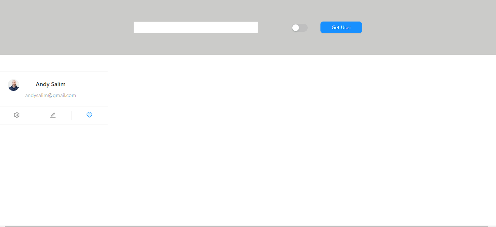

# API:

- https://randomuser.me/api/  for get 1 spesific random user
- https://randomuser.me/api/?results=10 for get list of users (10 user)
- https://randomuser.me/api/?gender=female for filtering by gender

# TODO:

1. show 10 random profile card
2. change profile card background: male to blue, female to pink
3. filter profile card by gender with toggle
4. filter profile card by name with searching box

